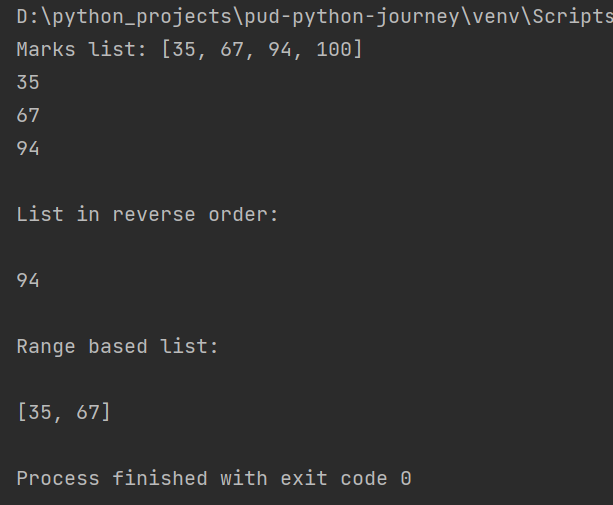

# pud-python-journey

1. **print-fn.py:**
This program prints "hello world"
  
Output: 

  

2. **variables.py:**
This program illustrates the following,
* Declaring variables
* Type conversion (numbers to string: We can't concatenate strings with numbers, so convert numbers to strings)
* Updating value of a variable
* Concatenation (by using '+' operator)
  Output:  

3. **inputs.py:**  
Accepting values from users and displaying in console.
  
Output: 
   
  

4. **sum_of_2_numbers.py:**  
This will take 2 integer inputs from users and print the sum  
 Output: 

  

5. **if-else.py:**  
This program checks the age input by user for voting rights.
  Output: 

  

6. **list.py:** 
This programs illustrates the following:
* Type conversion
* List indexing
* Printing range from the list
* Print list in reverse 
  Output: 

  

7. **tuple.py:** 
This program illustrates the following:
* Tuples are immutable
* Print frequency of number defined inside a tuple
* Iterate values inside tuple using for loop
  Output: 

  