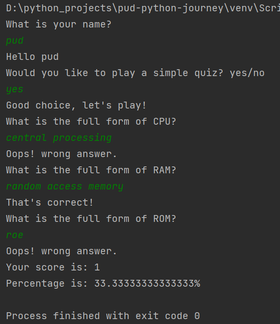
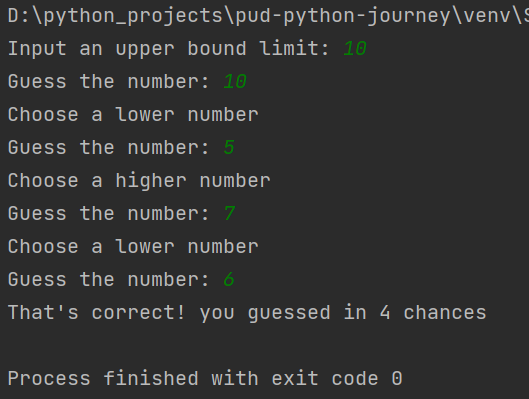
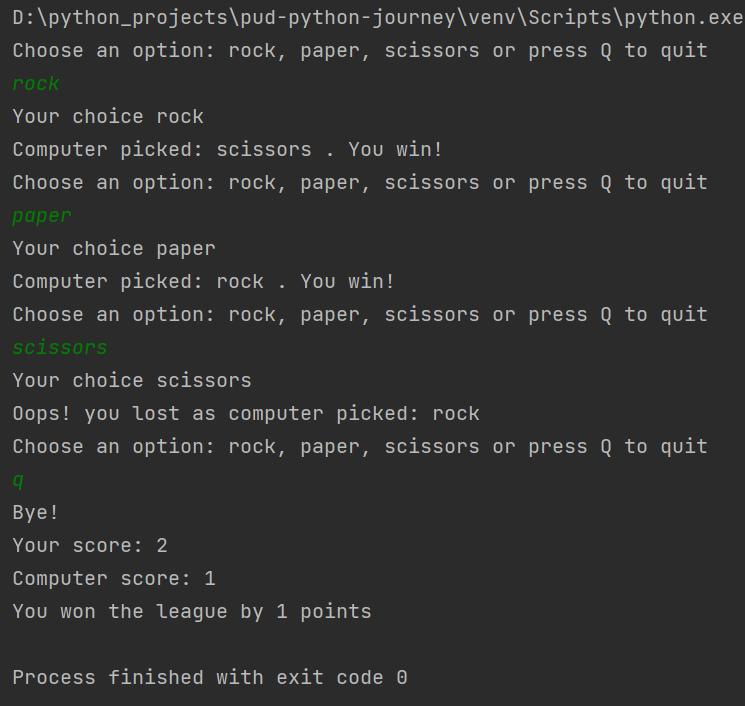

# pud-python-journey

1. **calculator.py:**
This is a basic calculator and performs the basic arithmatic operations
  
Output: 

  

2. **quiz_game.py:**
This program asks set of questions to user and gives them points if they guess it right
  
Output: 

  

3. **number_guess.py:**
This program asks users to guess a number that the computer is thinking of.
  
Output: 

  

4. **rock_pap_sci.py:**
This is a classic rock, paper and scissors game with scoreboard.
  
Output: 

  