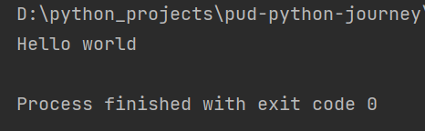

# pud-python-journey

1. print-fn.py:
This program prints "hello world"
  
Output: 

  
2. variables.py:
This program illustrates the following,
* Declaring variables
* Type conversion (numbers to string: We can't concatenate strings with numbers, so convert numbers to strings)
* Updating value of a variable
* Concatenation (by using '+' operator)
 
3. inputs.py:  
Accepting values from users and displaying in console.
  
Output: 

